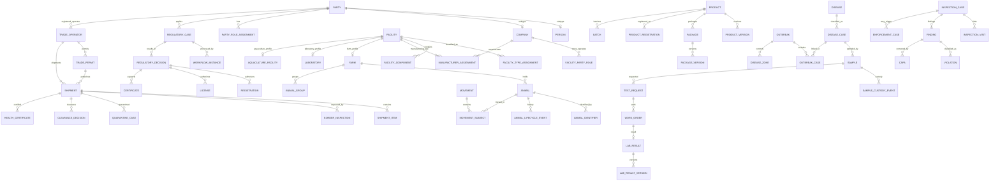

# LVSP High-Level Enterprise Relationship Model

```mermaid
erDiagram
    PARTY ||--o| PERSON : subtype
    PARTY ||--o| COMPANY : subtype
    PARTY ||--o{ PARTY_ROLE_ASSIGNMENT : has
    COMPANY ||--o{ FACILITY_PARTY_ROLE : owns_operates
    FACILITY ||--o{ FACILITY_TYPE_ASSIGNMENT : classified_as
    FACILITY ||--o{ FACILITY_COMPONENT : contains

    PARTY ||--o{ REGULATORY_CASE : applies
    REGULATORY_CASE ||--o{ WORKFLOW_INSTANCE : processed_by
    REGULATORY_CASE ||--o{ REGULATORY_DECISION : results_in
    REGULATORY_DECISION ||--o{ REGISTRATION : authorizes
    REGULATORY_DECISION ||--o{ LICENSE : authorizes
    REGULATORY_DECISION ||--o{ CERTIFICATE : supports

    PRODUCT ||--o{ PRODUCT_VERSION : versions
    PRODUCT ||--o{ PACKAGE : packages
    PACKAGE ||--o{ PACKAGE_VERSION : versions
    COMPANY ||--o{ MANUFACTURER_ASSIGNMENT : manufacturer
    FACILITY ||--o{ MANUFACTURER_ASSIGNMENT : manufacturing_site
    PRODUCT ||--o{ PRODUCT_REGISTRATION : registered_as
    PRODUCT ||--o{ BATCH : batches

    FACILITY ||--o| FARM : farm_profile
    FACILITY ||--o| LABORATORY : laboratory_profile
    FACILITY ||--o| AQUACULTURE_FACILITY : aquaculture_profile

    FARM ||--o{ ANIMAL : holds
    FARM ||--o{ ANIMAL_GROUP : groups
    ANIMAL ||--o{ ANIMAL_IDENTIFIER : identified_by
    ANIMAL ||--o{ ANIMAL_LIFECYCLE_EVENT : history
    ANIMAL ||--o{ MOVEMENT_SUBJECT : moved_in
    MOVEMENT ||--o{ MOVEMENT_SUBJECT : contains

    DISEASE ||--o{ DISEASE_CASE : classified_as
    DISEASE_CASE ||--o{ SAMPLE : sampled_by
    OUTBREAK ||--o{ OUTBREAK_CASE : includes
    DISEASE_CASE ||--o{ OUTBREAK_CASE : linked_to
    OUTBREAK ||--o{ DISEASE_ZONE : controls

    INSPECTION_CASE ||--o{ INSPECTION_VISIT : visits
    INSPECTION_CASE ||--o{ FINDING : findings
    FINDING ||--o{ VIOLATION : classified_as
    FINDING ||--o{ CAPA : corrected_by
    INSPECTION_CASE ||--o{ ENFORCEMENT_CASE : may_trigger

    SAMPLE ||--o{ SAMPLE_CUSTODY_EVENT : custody
    SAMPLE ||--o{ TEST_REQUEST : requested
    TEST_REQUEST ||--o{ WORK_ORDER : work
    WORK_ORDER ||--o| LAB_RESULT : result
    LAB_RESULT ||--o{ LAB_RESULT_VERSION : versions

    PARTY ||--o{ TRADE_OPERATOR : registered_operator
    TRADE_OPERATOR ||--o{ TRADE_PERMIT : permits
    TRADE_OPERATOR ||--o{ SHIPMENT : shipments
    TRADE_PERMIT ||--o{ SHIPMENT : authorizes
    SHIPMENT ||--o{ SHIPMENT_ITEM : contains
    SHIPMENT ||--o{ BORDER_INSPECTION : inspected_by
    SHIPMENT ||--o{ QUARANTINE_CASE : quarantined
    SHIPMENT ||--o{ CLEARANCE_DECISION : clearance
    SHIPMENT ||--o{ HEALTH_CERTIFICATE : certified
```

This diagram is intentionally high level. The authoritative physical model is the ordered migration set and `database/schema_inventory.json`.
